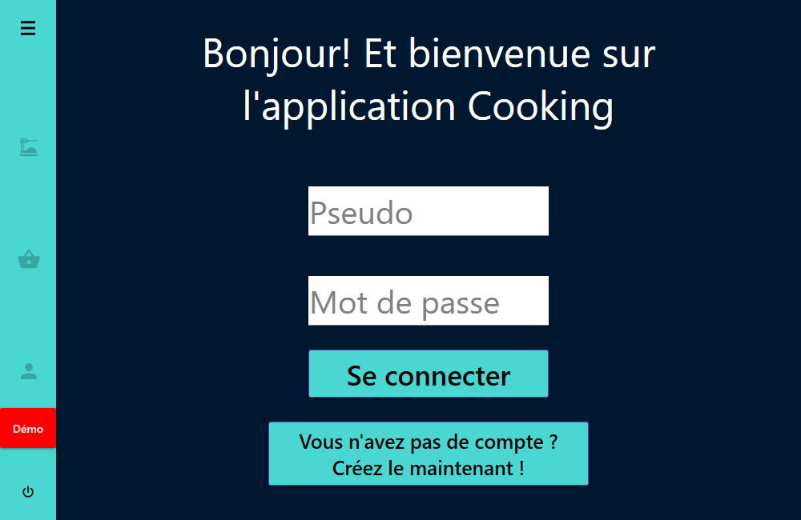

# Cooking
A desktop application for food amateurs that allows you to order food based on recipes from the Cooking communauty. This application is coded in C# and WPF, the server is SQL based as I used mySQL.

# Landing page

# Members
List of every members of the tennis club

# Tournaments
List of every tournament people from the club can compete in with the option to display the person that are already registered for this tournament

     
# Statistics
Some statistics regarding the tennis club and its members

     
# Memory
A little game to kill the time in between matches and train your memory

