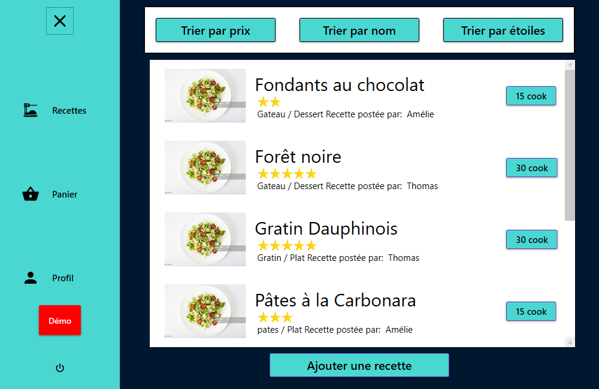
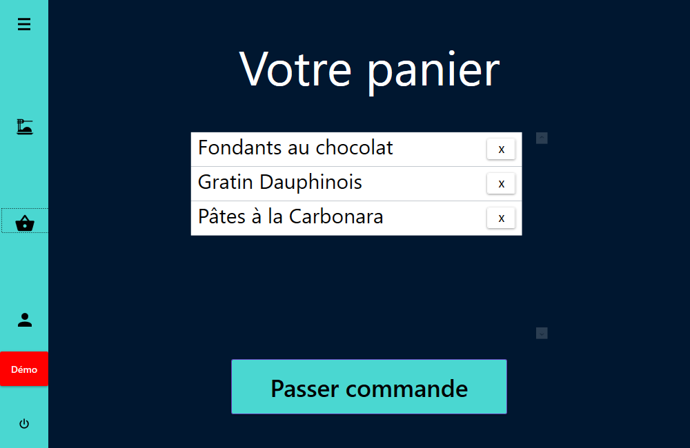

# Cooking
A desktop application for food amateurs that allows you to order food based on recipes from the Cooking communauty. This application is coded in C# and WPF, the server is SQL based as I used mySQL.

# Landing page
The menu on the left is by default collapsed, the screenshot under the Recipes section is shown with the menu expanded

# Recipes
List of the recipes offered by the community the sorting options trigger SQL requests to sort the data according to the user wishes

# Basket
List of all the recipes you choosed to order in the Recipes section

     
# Add recipes
The option for you to add your own recipes

     
# Demonstration
As the app was an academic project there needed to be a 'demo mode' in order to show that we were able to make some SQL requests and display some key data

  
